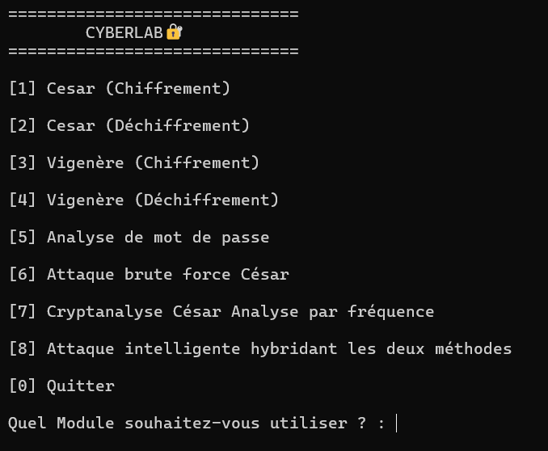
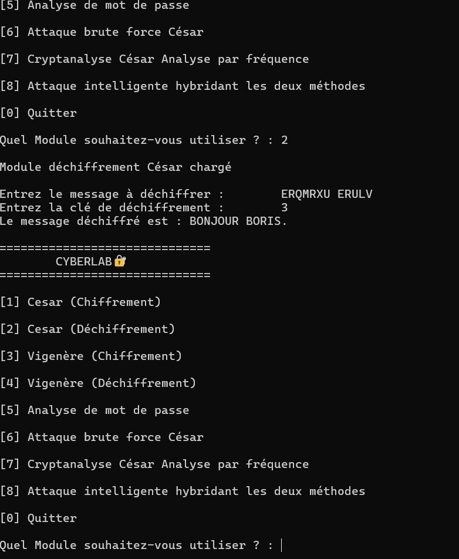
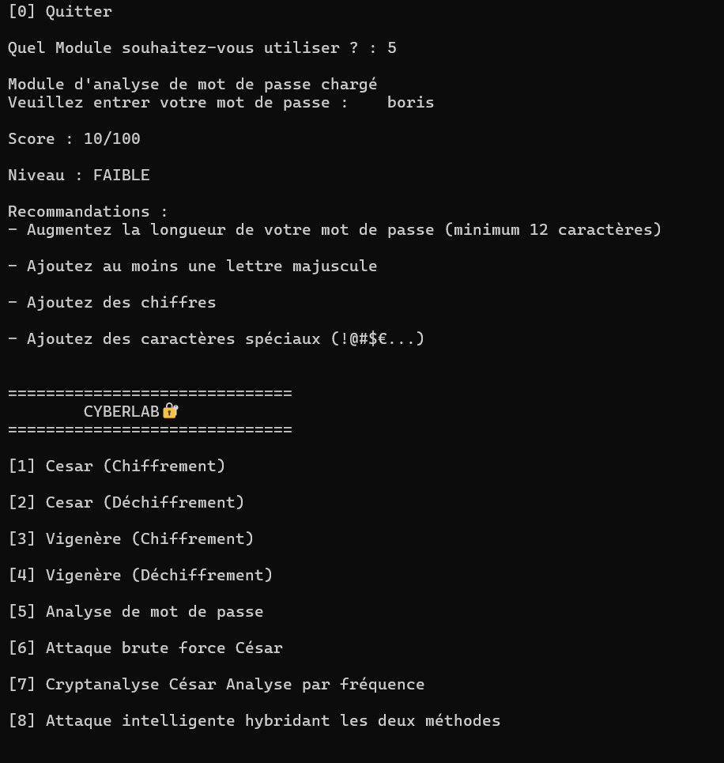

# 🔐 CyberLab — Outil de Cryptographie & Cryptanalyse

## 📌 Présentation

CyberLab est un outil développé en Python permettant d'explorer les mécanismes de chiffrement classique ainsi que quelques techniques de cryptanalyse.

Ce projet illustre concrètement des concepts fondamentaux en cybersécurité tels que :

+ le chiffrement symétrique
+ l'analyse statistique
+ les attaques par force brute

---

## 🚀 Fonctionnalités

### 🔐 Chiffrement

+ Chiffrement de César
+ Chiffrement de Vigenère

### 🔓 Déchiffrement

+ Déchiffrement César
+ Déchiffrement Vigenère

### 💥 Attaques

+ Attaque brute force (César)
+ Attaque par analyse de fréquence
+ Attaque intelligente (basée sur mots français)
+ Attaque hybride (statistique + linguistique)

### 🔍 Analyse

+ Analyse de la robustesse des mots de passe

---

## Aperçu

### Interface

### Exemple de chiffrement

### Analyse mot de passe

### Attaque intelligente
[Attaque](assets/attk_intelligente.png)

---

## 🧠 Concepts utilisés

+ Cryptographie classique
+ Cryptanalyse
+ Statistiques (analyse de fréquence)
+ Algorithmes
+ Structures de données (dictionnaires)

---

## ⚙️ Installation & utilisation

git clone https://github.com/BorisNightawk/CyberLab.git

cd CyberLab

python cyberlab.py

---

## 🎯 Objectif pédagogique

Ce projet a été réalisé dans une démarche d’apprentissage approfondi de la cybersécurité, avec un focus sur la compréhension des mécanismes internes des systèmes de chiffrement.

---

## 📈 Perspectives

Améliorations futures :

+ Attaques avancées sur Vigenère
+ Interface graphique (GUI)
+ Optimisation des performances
+ Ajout d'autres algorithmes (AES, RSA)

---

## 👨‍💻 Auteur

**Komla Bob Boris AGBOKA**

Étudiant en Mathématiques-Informatique

Passionné de cybersécurité